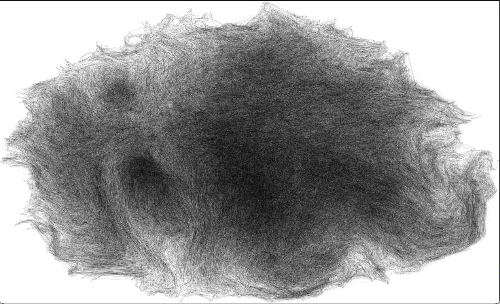

<h1 align="center">
  CS 225 Final Project
  </br>
</h1>

<table align="center">
  <tr>
    <td align="center"><a href="https://www.linkedin.com/in/daniel-moon1/"><br /><b>Daniel Moon</b></a><br /></td>
    <td align="center"><a href="https://www.linkedin.com/in/joseph-kuang-6bb55b1ba/"><br /><b>Joseph Kuang</b></a><br /></td>
    <td align="center"><a href="https://github.com/ajain1921"><br /><b>Aditya Jain</b></a><br /></td>
    <td align="center"><a href="https://www.linkedin.com/in/amit-m-sawhney/"><br /><b>Amit Sawhney</b></a><br /></td>
    </tr>
</table>

<h4 align="center">Amazing CS 225 Project Group Minus Amit</h4>

<p align="center">
  <a href="#background-and-leading-question">Background and Leading Question</a> •
  <a href="#repository-breakdown">Repository Breakdown</a> •
  <a href="#technologies">Technologies</a> •
  <a href="#running-the-project">Running The Project</a> •
  <a href="#test-suite">Test Suite</a>
</p>

<div align="center">
  
</div>

## Background and Leading Question

In our project, we are hoping to find some pattern between buying habits and how Amazon presents items that are frequently bought together. Specifically, we would like to explore the extent of importance of certain items, to see which items Amazon recommends together and if we can find any vertices that act as "hubs" for many items, meaning that it is more popular and bought with more other items. The final deliverable should rank these items by the number of items that are recommended with these "hub" nodes which reveals how likely it is to get from one place to another just through frequently bought together items.

The difference in the output we get from Betweenness Centrality and PageRank is that PageRank shows where all the edges lead to, while the Betweenness Centrality shows where all the shortests paths will go through as opposed to where they will end up.

[Full Proposal](https://github-dev.cs.illinois.edu/cs225-fa21/dm32-sawhney4-adityaj5-jjkuang2/blob/main/teamdocs/final_project_proposal.md) </br>
[Presentation Video](https://drive.google.com/file/d/1xwQN-el2-lN46PHbVswfz4erAs90USGh/view?usp=sharing)

## Repository Breakdown

- [Code](https://github-dev.cs.illinois.edu/cs225-fa21/dm32-sawhney4-adityaj5-jjkuang2/tree/main/src)
- [Data](https://github-dev.cs.illinois.edu/cs225-fa21/dm32-sawhney4-adityaj5-jjkuang2/tree/main/data)
- [Tests](https://github-dev.cs.illinois.edu/cs225-fa21/dm32-sawhney4-adityaj5-jjkuang2/tree/main/tests)
- [Results](https://github-dev.cs.illinois.edu/cs225-fa21/dm32-sawhney4-adityaj5-jjkuang2/tree/main/results)

### Configuring Data

Due to the size the data, please download the Amazon [dataset](http://snap.stanford.edu/data/amazon0302.html) and follow the instructions below.

1. Download the [dataset](http://snap.stanford.edu/data/amazon0302.html).
2. Extract the data into a file called `data.txt`. 
3. Drop the data into the `data/` directory.  

## Technologies

<table align="center">
  <tr>
    <td align="center"><a href="https://en.cppreference.com/w/"><br /><b>C++</b></a></td>
    <td align="center"><a href="https://www.gnu.org/software/make/manual/make.html"><br /><b>Makefile</b></a></td>
    <td align="center"><a href="https://github.com/catchorg/Catch2"><br /><b>Catch2</b></a></td>
    </tr>
</table>

## Running the Project

### Prerequisites

- Please make sure you have configured the data as mentioned above if you would like to run main code.
- Ensure that you are in the [root](https://github-dev.cs.illinois.edu/cs225-fa21/dm32-sawhney4-adityaj5-jjkuang2) directory. 

### Main 

```bash
make all
```

```bash
make
```

### Choosing Input File, Output Location, and algorithm
- `make`
- `./main data_path number_of_nodes name_output algorithm`
    - i.e. `./main data/input.txt 1200 output.txt dfs`

### List of all possible algorithms to run
- `dfs` - runs dfs algorithm
- `pagerank` - runs pagerank algorithm
- `betweenness` - runs betweenness centrality algorithm
- `all` - runs all algorithms

### Cleaning Directory

```bash
make clean
```
<br />
<br />
<h2 id="test-suite" align="center">Test Suite</h2>

### Runnings Tests

```bash
make test
```

#### Argument Example
```bash
make test [parse]
```
#### Available Arguments
- `parse`
- `dfs`
- `pagerank`
- `betwenness`

### Graph Parsing

Ensured reliable graph parsing from input files by testing the following conditions:
- Test connected directed graph
- Test connected undirected graph
- Test unconnected directed graph
- Test connected directed graph
- Edge cases
  -  Test extraneous info at top of file is not read

### DFS Traversal
Ensured correct DFS traversals by testing the following conditions:
- Test connected directed graph
- Test connected undirected graph
- Test unconnected directed graph
- Test unconnected undirected graph

### Page Rank Matrix
- Validated Google Page Rank matrix creation by calculating the values of the matrix
- Validated that the the values stored by the Sparse Matrix are accurate

### Matrix-Vector Multiplication 
- Validated Matrix-vector multiplication by calculating the values of the product

### Matrix-Sparce Vector Multiplication
Validated the values of Matrix-sparce vector calculations by testing the following conditions:
- Test Sparce Product with zero as sprace values
- Test Sparce Product with non-zero sparce values

### Vector Normalization
- Validated the norm of a vector by calculating the values of the normal vector

### Page Rank
Ensured accurate page rank calculations by testing the following conditions
- Test sparce connected graph
- Test sparce unconnected graph 

### Betweenness Centrality
- Test connected directed graph
- Test unconnected directed graph

<details>
  <summary>All tests</summary>
  
<code>Parse Nodes - Connected Directed Graph</code><br />
<code>Parse Nodes - Don't Read Complete File</code><br />
<code>Parse Nodes - Connected Undirected Graph</code><br />
<code>Parse Nodes - Multiple Components Directed Graph</code><br />
<code>Parse Nodes - Multiple Components Undirected Graph</code><br />
<code>DFS Traversal - Connected Directed Graph</code><br />
<code>DFS Traversals - Connected Undirected Graph</code><br />
<code>DFS Traversal - Multiple Components Directed Graph</code><br />
<code>DFS Traversal - Multiple Components Undirected Graph</code><br />
<code>Create Google Page Rank Matrix</code><br />
<code>Matrix Vector Multiplication</code><br />
<code>Sparse Matrix Vector Multiplication</code><br />
<code>Sparse Matrix Vector Multiplication with NonZero Sparse Values</code><br />
<code>2-Norm of Vector</code><br />
<code>Page Rank - Connected Graph</code><br />
<code>Page Rank - Multiple Components Graph</code><br />
<code>Betweenness Centrality - Directed One Component </code> <br/>
<code>Betweenness Centrality - Directed Multiple Components Graph </code> <br/>
</details>
